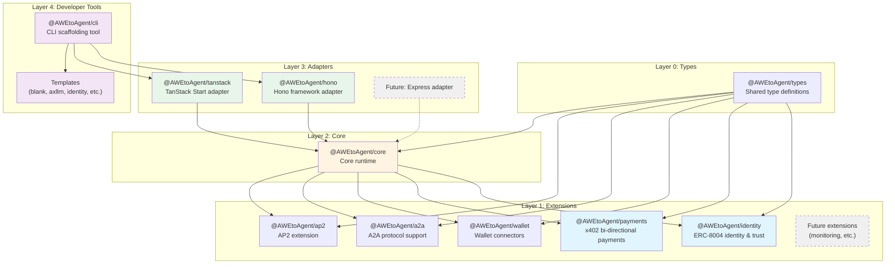
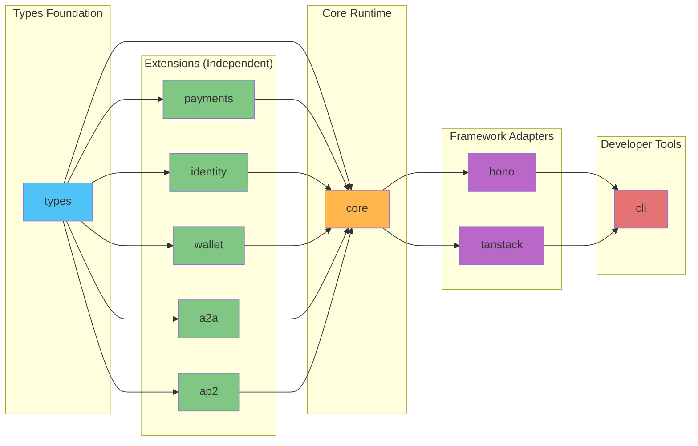
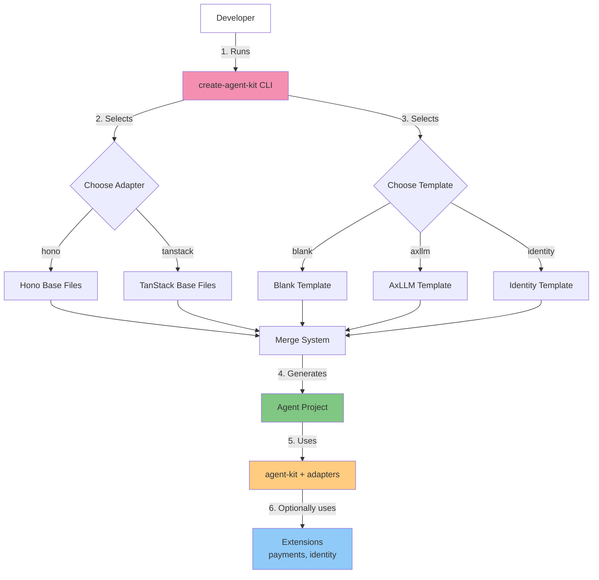
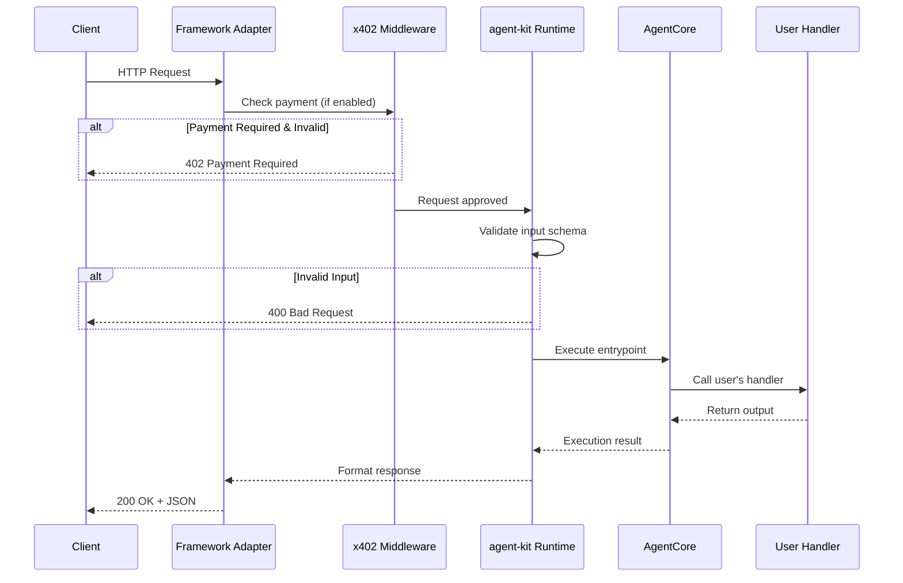
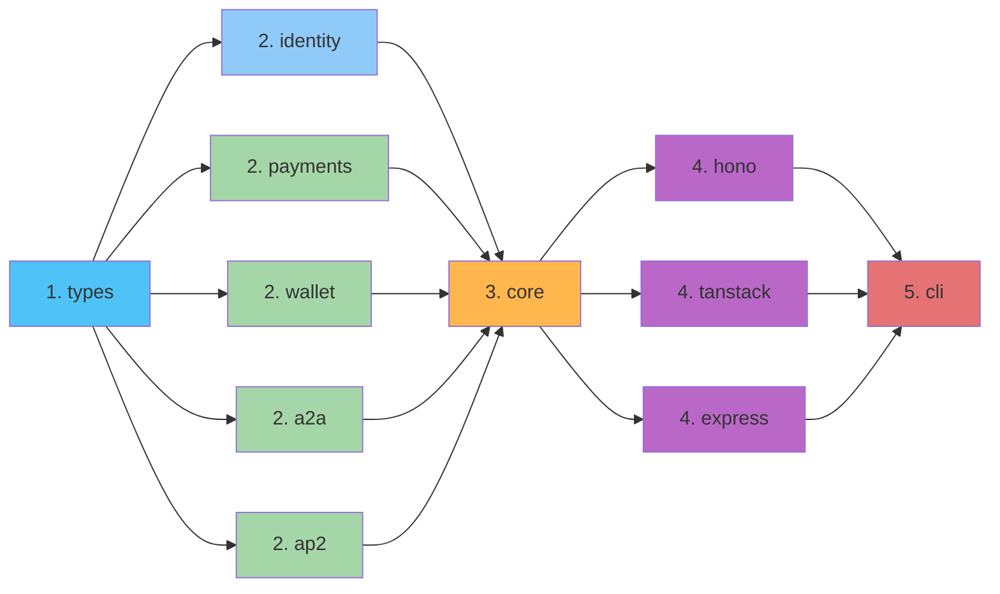

# AWEtoAgent - SDK Architecture

High-level architecture overview of the AWEtoAgent SDK.

## Package Structure

The SDK is organized into four architectural layers:



## Dependency Graph



Note: Dependencies are one-directional. @AWEtoAgent/core imports from extensions (both types and runtime functions). All packages import shared types from @AWEtoAgent/types. This pure DAG structure eliminates circular dependencies.

## Layer 1: Extensions

Extensions add optional capabilities. They are independent and don't depend on each other.

### @AWEtoAgent/identity

**Purpose:** ERC-8004 on-chain identity and trust layer

**Provides:**

- Registry clients (Identity, Reputation, Validation)
- Trust configuration
- Domain proof signing
- `createAgentIdentity()` bootstrap function

**Dependencies:** `viem` (Ethereum interactions)

---

### @AWEtoAgent/payments

**Purpose:** x402 payment protocol (bi-directional)

**Provides:**

- Entrypoint definitions (priced capabilities)
- Payment requirement resolution (server-side)
- x402 client utilities (client-side)
- Payment configuration and validation
- Multi-network support (EVM and Solana)

**Dependencies:** `x402`, `x402-fetch`, `zod`

---

### @AWEtoAgent/wallet

**Purpose:** Wallet connectors and helpers for agent operations

**Provides:**

- Wallet client creation and management
- Multi-network wallet support (EVM and Solana)
- Wallet configuration utilities

**Dependencies:** `viem` (Ethereum interactions)

---

### @AWEtoAgent/a2a

**Purpose:** Agent-to-Agent (A2A) protocol implementation

**Provides:**

- Agent Card building and fetching
- A2A client utilities (invoke, stream, task operations)
- Task-based operations (sendMessage, getTask, listTasks, cancelTask)
- Multi-turn conversation support with contextId
- A2A runtime integration

**Dependencies:** `@AWEtoAgent/types`, `zod`

---

### @AWEtoAgent/ap2

**Purpose:** AP2 (Agent Payments Protocol) extension

**Provides:**

- AP2 runtime creation
- Agent Card enhancement with AP2 extension metadata
- AP2 role management (merchant, shopper)

**Dependencies:** `@AWEtoAgent/types`

## Layer 2: Core

### @AWEtoAgent/core

**Purpose:** Framework-agnostic agent runtime

**Provides:**

- Agent execution (`AgentCore`)
- HTTP request handlers (invoke, stream, tasks)
- Server-Sent Events (SSE) streaming
- Manifest generation (AgentCard, A2A)
- Task management (create, get, list, cancel, subscribe)
- Configuration management
- Landing page UI

**Dependencies:** `@AWEtoAgent/payments`, `@AWEtoAgent/identity`, `@AWEtoAgent/wallet`, `@AWEtoAgent/a2a`, `@AWEtoAgent/ap2`

## Layer 3: Adapters

Adapters integrate the core runtime with specific web frameworks.

### @AWEtoAgent/hono

**Purpose:** Hono framework integration

**Provides:**

- `createAgentApp()` - Returns Hono app instance
- `withPayments()` - x402-hono middleware wrapper
- Automatic route registration for tasks, entrypoints, manifest

**Dependencies:** `@AWEtoAgent/core`, `hono`, `x402-hono`

---

### @AWEtoAgent/tanstack

**Purpose:** TanStack Start framework integration

**Provides:**

- `createTanStackRuntime()` - Returns runtime & handlers
- `withPayments()` - x402-tanstack middleware wrapper
- Route files for tasks, entrypoints, manifest

**Dependencies:** `@AWEtoAgent/core`, `@tanstack/start`, `x402-tanstack-start`

---

### @AWEtoAgent/express

**Purpose:** Express framework integration

**Provides:**

- `createAgentApp()` - Returns Express app instance
- `withPayments()` - x402 Express middleware wrapper
- Automatic route registration for tasks, entrypoints, manifest

**Dependencies:** `@AWEtoAgent/core`, `express`, `x402-express`

## Layer 4: Developer Tools

### @AWEtoAgent/cli

**Purpose:** CLI for scaffolding new agent projects

**Provides:**

- Interactive project wizard
- Template system (blank, axllm, identity, axllm-flow, trading-data-agent (merchant), trading-recommendation-agent (shopper))
- Adapter selection (hono, tanstack-ui, tanstack-headless, express)
- Merge system (combines adapter + template)

**Dependencies:** All @AWEtoAgent packages

## Developer Flow



## Request Flow

How an HTTP request flows through the system:



## Build Order

Packages must build in dependency order:



Note: All extension packages (identity, payments, wallet, a2a, ap2) are independent and can build in parallel. Core depends on all extensions, and adapters depend on core.

## Package Responsibilities

| Package                  | Responsibility                                               |
| ------------------------ | ------------------------------------------------------------ |
| `@AWEtoAgent/types`    | Shared type definitions (zero dependencies)                  |
| `@AWEtoAgent/identity` | ERC-8004 on-chain identity, registries, trust models         |
| `@AWEtoAgent/payments` | x402 protocol, EntrypointDef, pricing, payment client/server |
| `@AWEtoAgent/wallet`   | Wallet connectors and helpers for agent operations           |
| `@AWEtoAgent/a2a`      | A2A protocol implementation, Agent Cards, task operations    |
| `@AWEtoAgent/ap2`      | AP2 extension for Agent Cards                                |
| `@AWEtoAgent/core`     | Core runtime, HTTP handlers, SSE, manifest, config, UI       |
| `@AWEtoAgent/hono`     | Hono framework integration, middleware wiring                |
| `@AWEtoAgent/tanstack` | TanStack framework integration, middleware wiring            |
| `@AWEtoAgent/express`  | Express framework integration, middleware wiring             |
| `@AWEtoAgent/cli`      | CLI tool, templates, project scaffolding                     |

## Extension Independence

```mermaid
graph TB
    subgraph "Independent Extensions"
        identity[@AWEtoAgent/identity<br/>ERC-8004 identity]
        payments[@AWEtoAgent/payments<br/>x402 payments]
        wallet[@AWEtoAgent/wallet<br/>Wallet connectors]
        a2a[@AWEtoAgent/a2a<br/>A2A protocol]
        ap2[@AWEtoAgent/ap2<br/>AP2 extension]
    end

    subgraph "Core"
        core[@AWEtoAgent/core<br/>Uses all extensions]
    end

    identity -.->|optional| core
    payments -.->|optional| core
    wallet -.->|optional| core
    a2a -.->|optional| core
    ap2 -.->|optional| core

    style identity fill:#90caf9
    style payments fill:#a5d6a7
    style wallet fill:#a5d6a7
    style a2a fill:#a5d6a7
    style ap2 fill:#a5d6a7
    style core fill:#ffcc80
```

Extensions are independent modules that core can optionally use. They don't depend on each other.

## Types Package

`@AWEtoAgent/types` is the foundational package containing all shared type definitions.

### Key Characteristics

- **Zero dependencies** on other @AWEtoAgent packages
- **Only external dependencies**: zod, x402
- **Pure TypeScript types** - no runtime code
- **Single source of truth** for type contracts

### Contains

- `AgentMeta`, `AgentContext`, `Usage` - Core agent types
- `EntrypointDef`, `EntrypointPrice`, `EntrypointHandler` - Entrypoint types
- `PaymentsConfig`, `SolanaAddress` - Payment types
- Stream types for SSE responses

### Architecture Benefits

All packages import from @AWEtoAgent/types, creating a clean dependency DAG:

```mermaid
graph TD
    types[@AWEtoAgent/types]
    identity[@AWEtoAgent/identity]
    payments[@AWEtoAgent/payments]
    core[@AWEtoAgent/core]
    hono[@AWEtoAgent/hono]
    tanstack[@AWEtoAgent/tanstack]
    cli[@AWEtoAgent/cli]

    types --> identity
    types --> payments
    types --> core
    identity --> core
    payments --> core
    core --> hono
    core --> tanstack
    hono --> cli
    tanstack --> cli
```

**Benefits:**

- Zero circular dependencies (pure DAG)
- Explicit type contracts
- Better IDE support and type inference
- Smaller bundles (types erased at compile time)
- Easy to maintain and evolve

## Future Roadmap

Planned extensions and adapters:

```mermaid
graph TB
    subgraph "Existing"
        identity_now[@AWEtoAgent/identity]
        payments_now[@AWEtoAgent/payments]
        wallet_now[@AWEtoAgent/wallet]
        a2a_now[@AWEtoAgent/a2a]
        ap2_now[@AWEtoAgent/ap2]
        core_now[@AWEtoAgent/core]
        hono_now[@AWEtoAgent/hono]
        tanstack_now[@AWEtoAgent/tanstack]
        express_now[@AWEtoAgent/express]
    end

    subgraph "Planned Extensions"
        monitoring[monitoring<br/>Metrics & observability]
        storage[storage<br/>Persistent state]
    end

    subgraph "Planned Adapters"
        fastify[fastify]
        nextjs[nextjs]
    end

    core_now --> monitoring
    core_now --> storage

    core_now --> fastify
    core_now --> nextjs

    style monitoring fill:#fff59d,stroke-dasharray: 5 5
    style storage fill:#fff59d,stroke-dasharray: 5 5
    style fastify fill:#e1bee7,stroke-dasharray: 5 5
    style nextjs fill:#e1bee7,stroke-dasharray: 5 5
```

## Summary

The AWEtoAgent SDK follows a **layered, modular architecture**:

1. **Extensions** - Independent capabilities (identity, payments)
2. **Core** - Framework-agnostic runtime
3. **Adapters** - Framework-specific integrations
4. **Tools** - Developer experience (CLI, templates)

This enables:

- **Modularity** - Use only what you need
- **Extensibility** - Easy to add new extensions and adapters
- **Clarity** - Clear package boundaries
- **Scalability** - Foundation for future growth
