# q402 - EIP-7702 Delegated Payment Protocol

> 🚀 **Future-Ready Implementation**: This project is a complete, production-grade implementation of EIP-7702 delegated execution for gasless payments on BSC and EVM networks. 
>
> **EIP-7702 Timeline**: Expected in Ethereum Pectra upgrade (2025 Q2-Q3), followed by BSC adoption.
>
> 📋 This implementation is ready for deployment when networks activate EIP-7702 support.

A next-generation gasless payment protocol using EIP-7702 delegated execution. Built to enhance project influence and governance execution for Quack AI ecosystem.

**Inspired by the [x402 protocol](https://github.com/coinbase/x402)** - we extend the vision with EIP-7702's revolutionary approach.

## What is q402?

q402 uses EIP-7702's "user context push" to replace traditional ERC-20 allowance "pull" flow:

- **Users sign offline**: One EIP-7702 authorization tuple + one EIP-712 payment witness
- **Facilitator sponsors gas**: Submits type 0x04 (set-code) transaction on behalf of users
- **Funds transfer directly**: No prior approval needed, no user-paid gas

This protocol prioritizes BSC and theoretically supports all EIP-7702 enabled EVM chains.

## Core Features

- **EIP-7702 Delegated Execution** with sponsored gas
- **HTTP 402 Payment Semantics** with standardized `paymentDetails`
- **Single & Batch Payments** with multi-asset routing
- **Dual Anti-Replay**: EIP-7702 auth nonce + application-level nonce/paymentId
- **Strong Witness Binding**: Domain separation, order/resource context binding
- **Facilitator Role**: Stateless verification + settlement + observability

## Why q402?

Traditional x402 requires ERC-3009 support, limiting token compatibility. q402 eliminates this:

- ✅ Works with **any existing ERC-20** on BSC (no token upgrades)
- ✅ **No initial approval** transaction needed
- ✅ **Gasless for users** - facilitator sponsors all gas
- ✅ **Production-ready** for BSC mainnet/testnet
- ✅ **Compatible with Account Abstraction** (EIP-4337 infrastructure)

## Architecture Overview

q402 consists of four main components working together:

```mermaid
graph TB
    subgraph "Client Application"
        Client[Client SDK<br/>@q402/core]
    end
    
    subgraph "Resource Server"
        Server[Express/Hono Server]
        Middleware[Middleware<br/>@q402/middleware-express<br/>@q402/middleware-hono]
    end
    
    subgraph "Facilitator Service"
        Facilitator[Facilitator API<br/>@q402/facilitator]
        Verify[Verification Service]
        Settle[Settlement Service]
    end
    
    subgraph "Blockchain"
        Blockchain[BSC/EVM Network]
        Contract[Implementation Contract<br/>SignatureBasedExecutorV2]
    end
    
    Client -->|1. Request Resource| Server
    Server -->|2. 402 Payment Required| Client
    Client -->|3. Create & Sign Payment| Client
    Client -->|4. X-PAYMENT Header| Middleware
    Middleware -->|5. Verify Payment| Facilitator
    Facilitator -->|6. Check Signatures| Verify
    Verify -->|7. Verification Result| Middleware
    Middleware -->|8. Settle Payment| Facilitator
    Facilitator -->|9. Submit Transaction| Settle
    Settle -->|10. EIP-7702 Transaction| Blockchain
    Blockchain -->|11. Execute Transfer| Contract
    Contract -->|12. Transfer Tokens| Blockchain
    Blockchain -->|13. Transaction Receipt| Settle
    Settle -->|14. Settlement Result| Middleware
    Middleware -->|15. Resource + X-PAYMENT-RESPONSE| Client
```

## Complete Payment Flow

### Sequence Diagram: End-to-End Payment Process

```mermaid
sequenceDiagram
    participant User as User (EOA)
    participant Client as Client SDK
    participant Server as Resource Server
    participant Middleware as x402 Middleware
    participant Facilitator as Facilitator Service
    participant Blockchain as BSC Network
    participant Contract as Implementation Contract

    Note over User,Contract: Phase 1: Payment Request & Preparation
    
    User->>Client: Request resource access
    Client->>Server: GET /api/premium
    Server->>Middleware: Check payment status
    Middleware->>Client: 402 Payment Required<br/>(paymentDetails)
    
    Note over User,Contract: Phase 2: Client Creates Payment Signature
    
    Client->>Client: prepareWitness()<br/>Create EIP-712 message
    Client->>Client: signWitness()<br/>Sign with user's private key
    Client->>Client: prepareAuthorization()<br/>Create EIP-7702 auth tuple
    Client->>Client: signAuthorization()<br/>Sign auth tuple
    Client->>Client: createPaymentHeader()<br/>Combine & encode to Base64
    
    Note over User,Contract: Phase 3: Payment Submission & Verification
    
    Client->>Server: GET /api/premium<br/>+ X-PAYMENT header
    Server->>Middleware: Extract X-PAYMENT header
    Middleware->>Middleware: decodeBase64()<br/>Parse SignedPaymentPayload
    
    alt Auto-settle enabled
        Middleware->>Facilitator: POST /verify<br/>(payment payload)
        Facilitator->>Facilitator: verifyPaymentWithChecks()<br/>1. Check whitelist<br/>2. Verify EIP-712 signature<br/>3. Verify EIP-7702 authorization<br/>4. Check deadline & nonce
        Facilitator->>Middleware: Verification Result ✅
        
        Note over User,Contract: Phase 4: Settlement
        
        Middleware->>Facilitator: POST /settle<br/>(payment payload)
        Facilitator->>Facilitator: settlePaymentWithMonitoring()<br/>1. Encode function call<br/>2. Construct EIP-7702 tx<br/>3. Prepare authorization list
        Facilitator->>Blockchain: Send Type 0x04 Transaction<br/>(from: Facilitator, to: User EOA)
        
        Note over User,Contract: Phase 5: On-Chain Execution
        
        Blockchain->>Contract: Execute in User EOA context<br/>(delegated execution)
        Contract->>Contract: executeTransfer()<br/>1. Verify witness signature<br/>2. Check nonce & deadline<br/>3. Transfer ERC-20 tokens
        Contract->>Blockchain: Transfer tokens<br/>(from: User, to: Recipient)
        Blockchain->>Facilitator: Transaction Receipt ✅
        Facilitator->>Middleware: Settlement Result<br/>(txHash, blockNumber)
        Middleware->>Middleware: Generate X-PAYMENT-RESPONSE header
    else Verification only
        Middleware->>Facilitator: POST /verify
        Facilitator->>Middleware: Verification Result ✅
    end
    
    Note over User,Contract: Phase 6: Resource Delivery
    
    Middleware->>Server: Payment verified ✅
    Server->>Client: 200 OK<br/>+ Resource Data<br/>+ X-PAYMENT-RESPONSE header
    Client->>User: Display resource
```



### Detailed Component Interaction Flow


### EIP-7702 Transaction Structure


## Code Flow: Key Functions

### Client-Side Flow


### Server-Side Verification Flow


### Facilitator Settlement Flow

```mermaid
graph TD
    Receive[Receive /settle Request] --> Validate[Validate Payload Schema]
    Validate --> GetClients[Get Network Clients]
    GetClients --> SettlePay[settlePaymentWithMonitoring]
    
    SettlePay --> EncodeFunc[Encode executeTransfer Function<br/>With witness signature]
    EncodeFunc --> PrepareAuth[Prepare Authorization Tuple<br/>From payload]
    PrepareAuth --> ConstructTx[Construct EIP-7702 Transaction<br/>Type: 0x04<br/>To: User EOA<br/>Data: Function call<br/>authorizationList: [tuple]]
    
    ConstructTx --> SendTx[Send Transaction<br/>Facilitator pays gas]
    SendTx --> Wait[Wait for Confirmation]
    Wait --> CheckStatus{Status?}
    
    CheckStatus -->|Success| ReturnSuccess[Return Settlement Result<br/>txHash, blockNumber]
    CheckStatus -->|Failed| ReturnError[Return Error]
```

## Quick Start

### Installation

```bash
pnpm install
```

### Usage

#### 1. Client-Side Payment Creation

```typescript
import { createPaymentHeader, selectPaymentDetails } from "@q402/core";
import { privateKeyToAccount } from "viem/accounts";

// Create account
const account = privateKeyToAccount("0x...");

// Fetch 402 response from server
const response = await fetch("https://api.example.com/resource");
const paymentRequired = await response.json();

// Select payment method
const paymentDetails = selectPaymentDetails(paymentRequired, {
  network: "bsc-testnet",
});

// Create signed payment header
const paymentHeader = await createPaymentHeader(account, paymentDetails);

// Make request with payment
const result = await fetch("https://api.example.com/resource", {
  headers: {
    "X-PAYMENT": paymentHeader,
  },
});
```

#### 2. Server-Side Integration (Express)

```typescript
import express from "express";
import { createQ402Middleware } from "@q402/middleware-express";
import { createWalletClient, http } from "viem";
import { privateKeyToAccount } from "viem/accounts";
import { bscTestnet } from "viem/chains";

const app = express();

// Create sponsor wallet
const sponsor = privateKeyToAccount(process.env.SPONSOR_KEY);
const walletClient = createWalletClient({
  account: sponsor,
  chain: bscTestnet,
  transport: http(),
});

// Apply q402 middleware
app.use(
  createQ402Middleware({
    network: "bsc-testnet",
    recipientAddress: "0x...",
    implementationContract: "0x...",
    verifyingContract: "0x...",
    walletClient,
    endpoints: [
      {
        path: "/api/premium",
        amount: "1000000", // 1 USDT (6 decimals)
        token: "0x337610d27c682E347C9cD60BD4b3b107C9d34dDd",
        description: "Premium API access",
      },
    ],
  })
);

// Protected route
app.get("/api/premium", (req, res) => {
  res.json({
    data: "Premium content",
    payer: req.payment?.payer,
  });
});

app.listen(3000);
```

#### 3. Running the Facilitator

```bash
cd packages/facilitator

# Configure environment
cp .env.example .env
# Edit .env with your settings

# Start facilitator
pnpm run dev
```

The facilitator exposes REST endpoints:
- `POST /verify` - Verify payment signatures
- `POST /settle` - Submit payment to blockchain
- `GET /supported` - List supported networks
- `GET /health` - Health check

## Contract Interfaces

### Single Payment

```solidity
function executeTransfer(
  address owner,
  address facilitator,
  address token,
  address recipient,
  uint256 amount,
  uint256 nonce,
  uint256 deadline,
  bytes calldata signature
) external;
```

### Implementation Contract Flow


## Payload Examples

### Witness (EIP-712)

```json
{
  "domain": {
    "name": "q402",
    "version": "1",
    "chainId": 56,
    "verifyingContract": "0xServerVerifier"
  },
  "types": {
    "Witness": [
      {"name":"owner","type":"address"},
      {"name":"token","type":"address"},
      {"name":"amount","type":"uint256"},
      {"name":"to","type":"address"},
      {"name":"deadline","type":"uint256"},
      {"name":"paymentId","type":"bytes32"},
      {"name":"nonce","type":"uint256"}
    ]
  },
  "primaryType": "Witness",
  "message": {
    "owner": "0xOwner",
    "token": "0xTokenAddress",
    "amount": "1000000",
    "to": "0xServerSettlementWallet",
    "deadline": "1735660000",
    "paymentId": "0xdeadbeef...",
    "nonce": "123456789"
  }
}
```

### Authorization (EIP-7702)

```json
{
  "chain_id": 56,
  "address": "0xImplementation",
  "nonce": 42,
  "y_parity": 1,
  "r": "0x...",
  "s": "0x..."
}
```

Digest: `keccak(0x05 || rlp([chain_id, address, nonce]))`, signed by owner.

## HTTP 402 Integration

### Server Returns `paymentDetails`

```json
{
  "scheme": "evm/eip7702-delegated-payment",
  "networkId": "bsc-mainnet",
  "token": "0xTokenAddress",
  "amount": "1000000",
  "to": "0xServerSettlementWallet",
  "implementationContract": "0xImplementation",
  "witness": { /* EIP-712 typed-data */ },
  "authorization": { /* auth tuple template */ }
}
```

### Client Sends `X-PAYMENT` Header

Base64-encoded JSON containing both signed witness and signed authorization.

## Security

- **Dual Nonce**: EIP-7702 auth nonce + application nonce/paymentId
- **Short Deadline**: Expires after timeout, limits attack window
- **Implementation Whitelist**: Only approved contracts can be delegated to
- **Per-Account Limits**: Token amount caps, recipient blacklist, rate limits
- **Immutable Event Logs**: Audit-friendly, traceable
- **Revocation Path**: Users can clear delegation via EIP-7702 tx with `address = 0x0`

## Supported Networks

- **BNB Smart Chain** (Mainnet/Testnet) - EIP-7702 enabled
- Any EIP-7702 enabled EVM chain (configure RPC accordingly)

## Observability

- OpenTelemetry compatible traces/metrics
- Export via OTLP to Prometheus/Grafana/Honeycomb
- HTTP method, status, latency, routing metrics

## Configuration

### Environment Variables

```env
# Server
HOST=0.0.0.0
PORT=8080

# Signer
SPONSOR_PRIVATE_KEY=0x...

# RPC URLs (at least one required for each network)
RPC_URL_BSC_MAINNET=https://bsc-dataseed1.binance.org
RPC_URL_BSC_TESTNET=https://data-seed-prebsc-1-s1.binance.org:8545

# Whitelist
IMPLEMENTATION_WHITELIST=0x...,0x...
```

## Roadmap

- ✅ BSC mainnet/testnet support with sponsored payments & batch routing
- ✅ Complete TypeScript implementation with full type safety
- ✅ Express and Hono middleware support
- ✅ Standalone facilitator service
- ✅ Comprehensive documentation with architecture diagrams
- 🚧 Witness extensions (jurisdiction/KYC/identity weighting)
- 🚧 Smart nonce strategies & storage optimization
- 🚧 Cross-chain expansion to more EIP-7702 networks

## Packages

- **[@q402/core](./packages/core)** - Core SDK with client functions and type definitions
- **[@q402/facilitator](./packages/facilitator)** - Independent facilitator service
- **[@q402/middleware-express](./packages/middleware-express)** - Express middleware
- **[@q402/middleware-hono](./packages/middleware-hono)** - Hono middleware

## Getting Started

For production deployment and usage:

1. **Quick Start**: See [Docker Deployment Guide](./docs/DOCKER_DEPLOYMENT.md)
2. **Architecture**: Review [System Architecture](./docs/ARCHITECTURE.md)
3. **Security**: Read [Important Notices](./docs/IMPORTANT_NOTICE.md)

## Contributing

Contributions are welcome! Please see [CONTRIBUTING.md](./CONTRIBUTING.md) for guidelines.

## License

Apache-2.0

## Documentation

For detailed documentation, see the [`docs/`](./docs/) folder:

- [Architecture](./docs/ARCHITECTURE.md) - System architecture and design
- [Standards Compliance](./docs/STANDARDS_COMPLIANCE.md) - x402 protocol compliance
- [Deployment](./docs/DOCKER_DEPLOYMENT.md) - Docker and deployment instructions
- [Deployment Readiness](./docs/DEPLOYMENT_READINESS.md) - Current implementation status

## Acknowledgments

This project implements the [x402 protocol](https://github.com/coinbase/x402) standard with EIP-7702 extensions. q402 follows the official x402 specifications for:

- **HTTP 402 semantics** - Standard Payment Required responses
- **Header formats** - X-PAYMENT and X-PAYMENT-RESPONSE headers
- **Facilitator API** - Standard /verify, /settle, /supported endpoints
- **Client-server flow** - Compatible with any x402 implementation

The q402 implementation extends the standard with EIP-7702 delegated execution:
- ✅ **Gasless payments** - Users never pay gas fees
- ✅ **Universal ERC-20** - No token contract modifications needed
- ✅ **No approvals** - Direct transfers without pre-approval
- ✅ **Standard compliance** - Fully compatible with x402 ecosystem

## About Quack AI

q402 is developed by Quack AI to enhance governance execution and payment flows in decentralized ecosystems. Our governance scoring engine integrates directly with payment settlement for trusted, auditable proposal execution.

For more information: [Quack AI Website](https://quackai.ai/)

---

**Built with ❤️ for the decentralized web**
