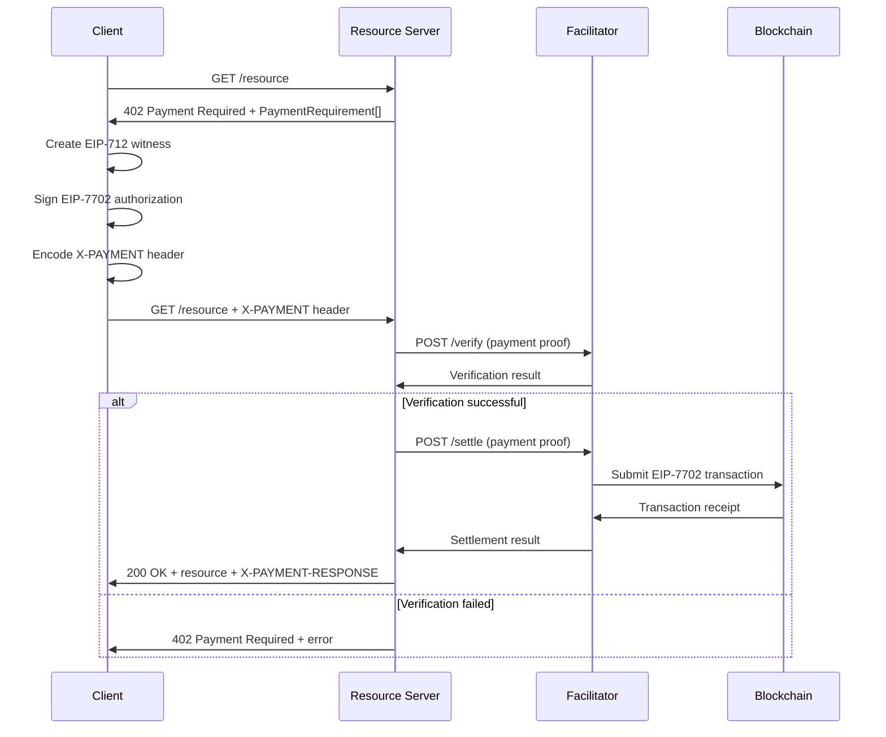

# q402 Core Protocol Specification

## Overview

q402 implements the [x402 payments protocol](https://github.com/coinbase/x402) with EIP-7702 delegated execution for gasless payments on BSC and EVM networks.

## Protocol Components

### 1. Resource Server

A server that provides resources in exchange for payment.

**Behavior:**
- Returns `402 Payment Required` for protected resources
- Accepts `X-PAYMENT` header with payment proof
- Verifies payments via facilitator service
- Returns resource with `X-PAYMENT-RESPONSE` header

### 2. Facilitator Server

A third-party service that verifies and settles payments.

**Endpoints:**
- `POST /verify` - Verify payment signature and constraints
- `POST /settle` - Submit payment transaction to blockchain  
- `GET /supported` - List supported schemes and networks

### 3. Client

Pays for resources by creating signed payment proofs.

**Capabilities:**
- Create EIP-712 witness signatures
- Generate EIP-7702 authorization tuples
- Send X-PAYMENT headers
- Handle 402 responses

## Protocol Flow



## Data Types

### PaymentRequiredResponse

```typescript
interface PaymentRequiredResponse {
  x402Version: number;
  accepts: PaymentRequirement[];
  error?: string;
}
```

### PaymentRequirement

```typescript
interface PaymentRequirement {
  scheme: string;                    // "evm/eip7702-signature-based"
  network: string;                   // "bsc-mainnet"
  maxAmountRequired: string;         // Amount in wei
  resource: string;                  // Resource URL
  description: string;               // Human readable description
  mimeType: string;                  // Response MIME type
  outputSchema?: object;             // Response schema
  payTo: string;                     // Recipient address
  maxTimeoutSeconds: number;         // Max settlement time
  asset: string;                     // Token contract address
  extra?: object;                    // Scheme-specific data
}
```

### PaymentHeader (X-PAYMENT)

```typescript
interface PaymentHeader {
  x402Version: number;
  scheme: string;
  network: string;
  payload: unknown;                  // Scheme-dependent payload
}
```

## Error Handling

- `400 Bad Request` - Invalid payment format
- `402 Payment Required` - Payment required or failed
- `500 Internal Server Error` - Server/facilitator error
- `503 Service Unavailable` - Facilitator unavailable

## Security Considerations

1. **Replay Protection**: Use nonces in both EIP-712 witness and EIP-7702 authorization
2. **Time Bounds**: Include deadlines in witness messages
3. **Amount Validation**: Verify payment amounts match requirements
4. **Signature Verification**: Validate all cryptographic signatures
5. **Implementation Whitelisting**: Only allow trusted implementation contracts

## Compliance

This specification ensures compatibility with:
- Standard x402 protocol semantics
- HTTP 402 Payment Required status code
- Standard header formats and naming
- Facilitator API compatibility
